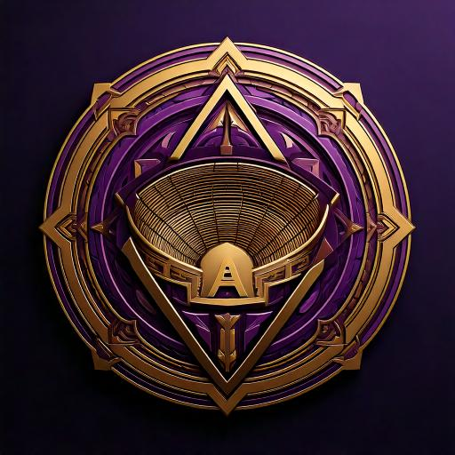

# 🏟️ Runic Arena - Forge Your Legend 🃏

<p align="center">
  
</p>

<!--  -->

[](LICENSE)
[](https://symfony.com/)
[](https://php.net/)

## 🌟 Unleash Your Creativity in the Mystical Realm of Runic Arena!

Welcome, brave souls, to the epicenter of card creation for the legendary Trading Card Game, Runic Arena! Here, your imagination becomes reality as you forge the very weapons that will decide the fate of countless battles.

### 🎭 What Awaits You?

- **🏠 Public Sanctuary**: Gaze upon the latest creations and witness the evolution of our realm.
- **🛡️ Summoner's Quarters**: Craft, refine, and manage your card proposals with arcane precision.
- **👑 Archmage's Sanctum**: For the chosen few, a place to oversee all creations and divine the future through mystical statistics.
- **🔮 Crystal Ball API**: Harness the power of `/api/cards` to scry all cards in the JSON realm.

### 🃏 Anatomy of Power

Each card you create is a unique tapestry of:

- **📛 Name**: The true name that holds power
- **🌓 Type**: Chaos or Halo, the eternal struggle
- **🏹 Class**: Mage, Healer, Warrior, Archer, or Assassin - choose your path
- **💥 Attack Power**: The raw force of your creation

### 🛠️ Arcane Tools of Creation

- **🏗️ Foundation**: Symfony 6.x, the bedrock of our magical construct
- **🎨 Illusions**: Twig + Tailwind CSS, weaving visual enchantments
- **📚 Grimoire**: MySQL, storing the ancient knowledge
- **🔐 Wards**: Symfony Security Bundle, protecting our sacred grounds
- **🧶 Threads of Fate**: AssetMapper, binding our world together
- **📊 Crystal Visions**: Chart.js, revealing the patterns of creation
- **🖼️ Mirror of Dreams**: VichUploaderBundle, capturing the essence of your imagination
- **🔗 Figma Design Blueprint**: [View the Design]([https://www.figma.com/file/your-design-link](https://www.figma.com/design/YGWQirghGkEqHnQOCyNBSw/Runica?node-id=0-1&t=DKH0j6RdANtNBGvF-1)

### 🧙‍♂️ Incantation of Installation

```bash
# Clone the sacred texts
git clone https://github.com/your-username/runic-arena.git

# Enter the sacred circle
cd runic-arena

# Summon the dependencies
composer install

# Whisper the secrets to .env

# Conjure the database
php bin/console doctrine:database:create

# Inscribe the runes
php bin/console doctrine:migrations:migrate

# Weave the visual enchantments
php bin/console asset-map:compile

# Awaken the portal
symfony server:start
````
# 🔮 Contributions - Join the Circle of Creators!

Your unique magic is welcome here! To contribute:

1. 🍴 Fork the mystical repository
2. 🌿 Create your feature branch (`git checkout -b feature/AmazingFeature`)
3. 💫 Commit your changes (`git commit -m 'Add some AmazingFeature'`)
4. 🌟 Push to the branch (`git push origin feature/AmazingFeature`)
5. 🎭 Open a Pull Request and let your magic be known!

### 🧙‍♂️ Archmage & Creator

Achraf Ait Mbarek

---

<p align="center">
  Made with ❤️ and ✨magic✨ by the Runic Arena team
</p>
